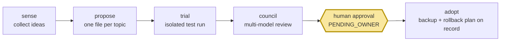

# self-growth-loop

<div align="center">

[🇺🇸 English](README.md) ｜ **🇯🇵 日本語** ｜ [🇨🇳 简体中文](README.zh.md) ｜ [🇹🇭 ไทย](README.th.md)


[](https://github.com/caty-ai/self-growth-loop/actions/workflows/test-lint.yml)
[](LICENSE)


あなたのAIは、自分自身のセットアップに対する改善案を次々と提案してきます——新しいツール、より良いプロンプト、ワークフローの微調整。<br>
それを手作業で取り込むのはスケールしませんし、かといってAIに勝手に変更させると、セットアップが気づかないうちに壊れていきます。<br>
self-growth-loopは、すべての提案を「テスト」「リスクに応じたレビュー」「**あなたの明示的な承認**」を勝ち取らなければ何も変わらない、追跡可能な提案に変換するツールです。

**監査できる成長。すべての変更は人間の関門を通過します。**

🔧 [エンジニアリングガイド](INTEGRATION.md) ｜ 📘 [仕様書](docs/ledger-spec.md)

</div>
<!-- repo-state:begin (generated; do not edit) -->
<p align="center"><sub>generation: <code>1b70e45</code> (2026-09-05T09:48:34Z) · verify: <a href="https://api.github.com/repos/caty-ai/self-growth-loop/commits/main">API HEAD</a> · <a href="./status.json">status.json</a></sub></p>
<!-- repo-state:end -->

---

## 思い当たりませんか？

- AIアシスタントが「ツールXを導入すべきです」と提案してくる——でも、それを扱うプロセスがないため、そのアイデアはチャットログの中で消えていく
- エージェントに自分の設定をいじらせてみたら、何が変わったのか把握するだけで一晩を費やしてしまった
- 改善案は溜まっていく一方で、何を試したか、何がうまくいったか、何が却下されたかの記録が残らない
- AIには時間をかけて良くなってほしいけれど、自分の知らないところで勝手に変わってほしくはない

self-growth-loopは、まさにこのギャップを埋めるために存在するツールです。AI主導の改善に「記録」と「ブレーキ」を与えます。

---

## できること

すべての改善案は**台帳の中の1ファイル**になり、5つの関門を通過していきます。人間の関門を飛ばすことはできません。



- 📒 **記録する** — すべての提案はプレーンテキストのファイルとして、誰が提案したか、何がテストされたか、誰が投票したか、誰が承認したかという完全な状態履歴を持ちます
- 🧪 **まずテストする** — 提案はサンドボックス化されたエンジンのワークスペース内で、隔離された試行タスクとして実行されます。あなたの本番セットアップで直接実行されることは決してありません
- 🗳️ **多角的に検証する** — 最もリスクの低いティアを除くすべての提案は、異なるAIモデルによる評議会が、あなたに届く前に試行結果の証拠を独立してレビューします
- ✋ **あなたを待つ** — すべての採用は、人間がゴーサインを出すまで承認キューで止まります。自ら勝手に適用されることはありません
- 🔙 **後戻りできる** — すべての採用には検証済みのバックアップ参照とロールバック計画が記録され、導入後は同梱のcronが毎日実行するlintが滞留したレコードや破損したレコードを検出します

1つの提案が最初から最後までたどる道のりを見てみましょう。

---

## 60秒でわかるループ

1つの提案がたどる道のりはこうです。フィードに入ってきたアイテム（「ツールXが良さそうだ」）が台帳のレコード（`PROPOSED`）になります。試行ランナーがそれをタスクとしてパッケージ化してエンジンに渡し、エンジンは隔離されたワークスペースの中でそれを実行します（`TRIALING`）。結果は証拠ファイルとして返ってきます。最もリスクの低いティアを除いては、異なるAIモデルによるパネルがそれぞれ証拠を読み、投票します（`COUNCIL`——最もリスクが低く可逆的なティアの場合は、投票の代わりに封印されたスキップ記録が残り、そのままあなたのキューに進みます）。投票が通れば、そのレコードはあなたの承認キューで待機します（`PENDING_OWNER`）——キューレポートが、待機中のすべての判断をあなたに示します。あなたが承認して初めてレコードは `ADOPTED` に移り、その時点で検証済みの採用前バックアップ参照と数値化されたロールバック計画がすでにファイルに記録されています——そのうえで、対象のランタイムが変更を適用します。却下すれば、そのレコードには永久にその結果が記録されます——何か重要な変化がない限り、同じアイデアが再び戻ってくることはありません。自分の手で実際にやってみるために必要なものは、ごくわずかです。

---

## 必要なもの

| | 要件 | 備考 |
|---|---|---|
| OS | macOS | ✅ テスト済み（標準の bash 3.2 + システムの ruby、gem不要） |
| | Linux | ✅ CIテスト済み |
| | WSL2 | ✅ 注意点あり — [Linux / WSL2 scheduling](INTEGRATION.md#linux--wsl2-scheduling) を参照 |
| 単体利用 | 他に何も不要 | 台帳＋lint＋キューレポートはこのリポジトリだけで動作します |
| 試行 | [caty-agent-harness](https://github.com/caty-ai/caty-agent-harness) のローカルチェックアウト | 試行タスクを実行するエンジン（固定バージョン: v0.6.0） |

---

## はじめよう

### AIにセットアップを頼む

これをコーディングエージェント（Claude Code、Codexなど）に貼り付けてください。

> Clone https://github.com/caty-ai/self-growth-loop and run `make test`. Then show me how to create a demo proposal with scripts/propose.sh against a temporary vault directory.

### 自分の手でやる場合

```sh
git clone https://github.com/caty-ai/self-growth-loop.git
cd self-growth-loop

# create a demo proposal in a throwaway vault
mkdir -p /tmp/sgl-demo-vault
bash scripts/propose.sh --vault /tmp/sgl-demo-vault \
  --topic-key demo-tool__acme --title "Trial the demo tool" \
  --state PROPOSED --proposer mine \
  --url https://example.com/item --report reports/demo.md

# run the health check and read the queue report it writes
bash scripts/growth-lint.sh --vault /tmp/sgl-demo-vault
cat /tmp/sgl-demo-vault/25_review-pending/self-growth-queue.md
```

これで、ループの記帳処理を一通り実行できました。提案レコードが作成され、lintにかけられ、レポートされました。（レポートには `SENSE BROKEN` と表示されますが、これは想定どおりです——単体デモにはフィードコレクターが接続されていないためです。）`rm -rf /tmp/sgl-demo-vault` を実行すればすべて元に戻せます——リポジトリ自体には一切書き込みが行われていません。

<details>
<summary>テストスイート全体を実行する（エンジンが必要）</summary>

```sh
# ~/claude-workspace/caty-agent-harness is the default lookup path (SGL_ENGINE_SOURCE)
git clone https://github.com/caty-ai/caty-agent-harness.git ~/claude-workspace/caty-agent-harness
cd self-growth-loop
make test                  # 全テストスイート。エンジン統合テストは実エンジンを動かします
```

エンジンのチェックアウトが別の場所にある場合は、`SGL_ENGINE_SOURCE` でそのパスを指定してください。

</details>

---

## なぜ安心して試せるのか

- **人間の関門は、単なる建前ではなく構造そのものです。** すべての採用は `PENDING_OWNER`——オーナー専用の承認キュー（エンジンの[ガバナンスルール](https://github.com/caty-ai/caty-agent-harness/blob/main/docs/governance-rules.md)、ルールR4）——で止まります。さらにこのリポジトリ自身の[採用ルール](docs/adoption-wiring.md)がすべてのティアにこれを適用するため、最もリスクの低い評議会スキップの経路であっても、オーナーの関与を飛ばすことはありません。検証済みのオーナー承認アーティファクトなしに、レコードが `ADOPTING` へ進むコードパスは存在しません。アイデンティティに関わる変更は、これに加えて必ず評議会全体のレビューも通過します（ルールR12a）。
- **試行があなたの本番セットアップに触れることはありません。** 試行は隔離されたエンジンのワークスペース内で実行され（[docs/trial-isolation.md](docs/trial-isolation.md)）、このプラグインがエンジンに書き込むのはタスクファイルだけです。
- **ロックつきのシングルライター・プロトコル。** 台帳は正規の書き込み主体を1つに定めており（加えてlintのための限定的なタイムアウト経路のみ例外）、すべての書き込みは同じロックを通り、すべての状態遷移がイベント行として残ります——状態が密かに書き換えられることはありません（[docs/ledger-spec.md](docs/ledger-spec.md)）。
- **ロールバックは採用プロセスの一部です。** 検証済みの採用前バックアップ参照がレコードに記録されていない限り承認され得ず、数値化されたロールバック手順は毎日の lint が監査します（[docs/adoption-wiring.md](docs/adoption-wiring.md)）。

こんな方には向きません: 人間を介さずに完全自動で自己改善するエージェントが欲しい方——このツールは、まさにそれを防ぐために作られています。

---

## 単体でも、連携させても

- **単体利用** — このリポジトリと台帳用のディレクトリだけで動きます。提案・lint・レビューを手動で行います（上のクイックスタートで実際にやったことです）。
- **連携利用** — より大きなセットアップに組み込むこともできます。すべて任意です: アイデアを供給するフィードコレクター（sense・例: [X Collector](https://github.com/caty-ai/x-collector)）、試行を実行する[caty-agent-harness](https://github.com/caty-ai/caty-agent-harness)エンジン、wrapper を定期実行する launchd または Linux の systemd/cron（`ops/`、導入手順は[INTEGRATION.md](INTEGRATION.md)）、外部監視があるならデッドマン・ハートビートなど。

---

## 実装済みの機能

| コンポーネント | 状態 | 場所 |
|---|---|---|
| 提案台帳（スキーマ、状態遷移、シングルライター） | ✅ 実装済み | [docs/ledger-spec.md](docs/ledger-spec.md), `scripts/propose.sh` (#1) |
| 失敗の可視化（growth-lint、キューレポート、タイムアウト） | ✅ 実装済み | `scripts/growth-lint.sh` (#2, #5) |
| 試行ランナー（エンジンの `tr-enqueue` によるタスクバンドル） | ✅ 実装済み | `scripts/trial-enqueue.sh`, `trial-poll.sh` (#6, #21) |
| 評議会（モデル横断の判定、ティア別クォーラム） | ✅ 実装済み | `scripts/council-*.sh`, [docs/council-wiring.md](docs/council-wiring.md) (#10, #13) |
| 採用実行系（承認キュー、ロールバック記録） | ✅ 実装済み | `scripts/adopt-*.sh`, [docs/adoption-wiring.md](docs/adoption-wiring.md) (#11, #16) |
| 共有ライブラリの切り出し | ⏳ 保留中 | 2つ目のプラグインが登場するまで意図的に保留（切り出し方針の詳細はエンジンのplugin-convention参照） |

✅ が付いている行はすべてテストつきで提供されています——`make test` で実行できます。テストスイートには、固定タグの実エンジンを動かすエンジン統合テストも含まれます。

---

## プロジェクトの状況

- **CI:** すべての pull request で、共有の test/lint caller が Ubuntu と macOS の両方で走ります。あわせて gitleaks・history-check・PR サイズ・公開ゲート・リスクレビューも走り、`main` はこの8つすべてを必須にしています。`make test` は引き続きローカルのゲートです。
- **検証済み環境:** macOS と Ubuntu（bash 3.2+、システムの ruby）。どちらも pull request ごとに CI で実行されています。その他の OS は未検証です。
- **成熟度:** **reference** — このリポジトリに対するキャンペーン指定です。公開ゲートの配線は導入済みです。
- **既知の制約:** ruby は必須で、ない場合はエントリースクリプトが 127 で終了します。エンジン統合は [caty-agent-harness v0.6.0](https://github.com/caty-ai/caty-agent-harness/tree/v0.6.0) に固定されています。

---

## もっと詳しく

| ドキュメント | 内容 |
|---|---|
| [INTEGRATION.md](INTEGRATION.md) | エンジンとの接続点、固定バージョン、cronの導入方法、統合テストの方針 |
| [docs/ledger-spec.md](docs/ledger-spec.md) | レコードのスキーマ、トピックの識別方法、状態遷移、ロック |
| [docs/trial-isolation.md](docs/trial-isolation.md) | リスクレベル別の隔離ティア |
| [docs/council-wiring.md](docs/council-wiring.md) | パネル構成、判定スキーマ、クォーラム、リトライ |
| [docs/adoption-wiring.md](docs/adoption-wiring.md) | 承認関門の仕組み、ロールアウト、ロールバック |

<!-- family:generated:family-footer:start -->

---

このリポジトリは **Caty AI ファミリー** の一員です — AI エージェントの家族を運用するためのオープンなツール群。公開準備中のモジュールを含む全体の地図は [Family OS](https://github.com/caty-ai/family-os) にあります。

| 軸 | モジュール | 何をするもの | 状態 |
| --- | --- | --- | --- |
| 地図 | [Family OS](https://github.com/caty-ai/family-os) | AIファミリー全体の地図 — モジュール・状態・つながり | 公開・MIT |
| 掟 | [Family Dev Handbook](https://github.com/caty-ai/family-dev-handbook) | 開発の交通ルール — Issue・PR・worktree・受け渡し・並行開発 | 公開・MIT |
| 縦軸・基盤 | [Caty Agent Harness](https://github.com/caty-ai/caty-agent-harness) | AIエージェントのタスク基盤 — 試行・リトライ・チェックポイント・完了判定 | 公開・MIT |
| 縦軸 | [context-kit](https://github.com/caty-ai/context-kit) | エージェント1体分の6点コンテキスト衛生キット — 大出力の退避・委譲ブリーフ検査・安全フック・記憶検索・worktree スナップショット | 公開・MIT |
| 縦軸 | [Persona Engine](https://github.com/caty-ai/persona-engine) | エージェントの既存人格に関係と感情のレイヤーを重ねる | 公開・MIT |
| 縦軸 | [Persona Growth Loop](https://github.com/caty-ai/persona-growth-loop) | 人格そのものを育てる — 最小・冪等な提案づくり | 公開・MIT |
| 縦軸 | [X Collector](https://github.com/caty-ai/x-collector) | Xやウェブの素材を1日1回のダイジェストに — 人にもエージェントにも | 公開・MIT |
| 縦軸 | **Self Growth Loop** | エージェントが自分の能力を育てるループ — 提案・ガバナンス・採用記録 | 公開・MIT |
| 横軸・基盤 | [Family Memory Architecture](https://github.com/caty-ai/family-memory-architecture) | 記憶バス — 家族が知っていることを共有する層 | 公開・MIT |
| 横軸 | [Sitter](https://github.com/caty-ai/sitter) | 委譲したエージェント実行の見張り番 — 監視・証拠の記録・宣言した範囲内でのみ再起動 | 公開・MIT |
| 横軸 | [Alpha Nightshift](https://github.com/caty-ai/alpha-nightshift) | 夜間自律保守ループ — deny-by-default の guard の内側で夜のレーンが走り、朝は人間が cherry-pick するだけ | 公開・MIT |

<!-- family:generated:family-footer:end -->

---

## コントリビュート

Issue起点: 1 issue = 1 branch = 1 pull requestとし、自己マージは行いません。詳しくは[CONTRIBUTING.md](CONTRIBUTING.md)と[family dev handbook](https://github.com/caty-ai/family-dev-handbook)を参照してください。

---

## ライセンス

[MIT](LICENSE) — 誰でも自由に使用・学習・発展させることができます。

---

<div align="center">

**bash + ruby、gem不要** ｜ **1提案＝1ファイル** ｜ **すべての変更は人間の関門を通過する**

</div>
