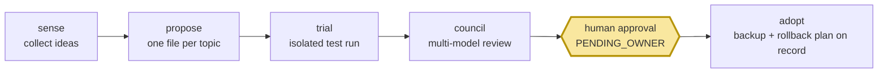

# self-growth-loop

<div align="center">

**🇺🇸 English** ｜ [🇯🇵 日本語](README.ja.md) ｜ [🇨🇳 简体中文](README.zh.md) ｜ [🇹🇭 ไทย](README.th.md)


[](LICENSE)


Your AI keeps suggesting improvements to its own setup — new tools, better prompts, workflow tweaks.<br>
Adopting them by hand doesn't scale; letting the AI change things by itself is how setups get quietly broken.<br>
self-growth-loop turns every suggestion into a tracked proposal that must earn its way through testing, risk-scaled review, and **your explicit approval** before anything changes.

**Growth you can audit. Every change passes a human gate.**

🔧 [Engineering guide](INTEGRATION.md) ｜ 📘 [Specifications](docs/ledger-spec.md)

</div>

---

## Sound familiar?

- Your AI assistant says "we should adopt tool X" — and the idea dies in a chat log because there's no process for it
- You tried letting an agent tweak its own configuration once, and spent an evening figuring out what changed
- Improvement ideas pile up with no record of what was tried, what worked, and what was rejected
- You want your AI to get better over time, but not behind your back

self-growth-loop exists for exactly this gap: it gives AI-driven improvement a paper trail and a brake pedal.

---

## What it does

Every improvement idea becomes **one file in a ledger** that moves through five gates. Nothing skips the human gate.



- 📒 **Tracks** — every proposal is a plain-text file with a full state history: who proposed it, what was tested, who voted, who approved
- 🧪 **Tests first** — proposals run as isolated trial tasks in a sandboxed engine workspace, never in your live setup
- 🗳️ **Cross-examines** — anything beyond the lowest risk tier gets a council of different AI models reviewing the trial evidence independently before it reaches you
- ✋ **Waits for you** — every adoption stops at an approval queue until a human says yes; nothing applies itself
- 🔙 **Backs out** — every adoption records a verified backup reference and a rollback plan, and a lint — run daily by the bundled cron once installed — catches stuck or damaged records

Here is one proposal's life, start to finish.

---

## The loop in 60 seconds

One proposal's life: a feed item ("tool X looks useful") becomes a ledger record (`PROPOSED`). The trial runner packages it as a task and hands it to the engine, which runs it in an isolated workspace (`TRIALING`). Results come back as evidence files; for anything beyond the lowest risk tier, a panel of different AI models each reads the evidence and votes (`COUNCIL` — the lowest, reversible tier records a sealed skip instead and goes straight to your queue). If it passes, the record waits in your approval queue (`PENDING_OWNER`) — the queue report shows you every waiting decision. Only after you approve does the record move to `ADOPTED`, with a verified pre-adoption backup reference and a quantified rollback plan already on the file — the owning runtime then applies the change. Reject it, and the record says so forever — the same idea won't come back unless something material changes. To run this yourself, you need very little.

---

## What you need

| | Requirement | Notes |
|---|---|---|
| OS | macOS | ✅ tested (stock bash 3.2 + system ruby, no gems) |
| | Linux | ⚠️ untested |
| Standalone use | nothing else | ledger + lint + queue report work with just this repo |
| Trials | a local checkout of [caty-agent-harness](https://github.com/caty-ai/caty-agent-harness) | the engine that runs trial tasks (pinned: v0.2.0) |

---

## Get started

### Ask your AI to set it up

Paste this to your coding agent (Claude Code, Codex, etc.):

> Clone https://github.com/caty-ai/self-growth-loop and run `bash tests/run.sh`. Then show me how to create a demo proposal with scripts/propose.sh against a temporary vault directory.

### Or do it yourself

```sh
git clone https://github.com/caty-ai/self-growth-loop.git
cd self-growth-loop

# create a demo proposal in a throwaway vault
mkdir -p /tmp/sgl-demo-vault
bash scripts/propose.sh --vault /tmp/sgl-demo-vault \
  --topic-key demo-tool__acme --title "Trial the demo tool" \
  --state PROPOSED --proposer mine \
  --url https://example.com/item --report reports/demo.md

# run the health check and read the queue report it writes
bash scripts/growth-lint.sh --vault /tmp/sgl-demo-vault
cat /tmp/sgl-demo-vault/25_review-pending/self-growth-queue.md
```

You just ran the loop's bookkeeping end to end: a proposal record was created, linted, and reported. (The report will shout `SENSE BROKEN` — expected: a standalone demo has no feed collector wired in.) Undo everything with `rm -rf /tmp/sgl-demo-vault` — the repo itself was never written to.

<details>
<summary>Run the full test suite (needs the engine)</summary>

```sh
# ~/claude-workspace/caty-agent-harness is the default lookup path (SGL_ENGINE_SOURCE)
git clone https://github.com/caty-ai/caty-agent-harness.git ~/claude-workspace/caty-agent-harness
cd self-growth-loop
make test                  # full suite; the engine integration test drives the real engine
```

Point `SGL_ENGINE_SOURCE` at your engine checkout if it lives somewhere else.

</details>

---

## Why it's safe to try

- **The human gate is structural, not polite.** Every adoption stops at `PENDING_OWNER`, the dedicated owner-approval queue (engine [governance rules](https://github.com/caty-ai/caty-agent-harness/blob/main/docs/governance-rules.md), rule R4) — and this repo's own [adoption rules](docs/adoption-wiring.md) apply it to every tier: the lowest-risk council-skip path never skips the owner. No code path advances a record to `ADOPTING` without a verified owner-authorization artifact; identity-critical changes always additionally pass the full council (rule R12a).
- **Trials never touch your live setup.** They run in an isolated engine workspace ([docs/trial-isolation.md](docs/trial-isolation.md)); the only thing this plugin ever writes into an engine is a task file.
- **A single-writer protocol with locking.** The ledger names one writer of record (plus the lint's narrow timeout lane), every write goes through the same lock, and every transition leaves an event line — a state won't be silently rewritten ([docs/ledger-spec.md](docs/ledger-spec.md)).
- **Rollback is part of adoption.** A record can't be approved without a verified pre-adoption backup reference on it, and a quantified rollback path that the daily lint audits ([docs/adoption-wiring.md](docs/adoption-wiring.md)).

Not for you if: you want a fully-automatic self-improving agent with no human in the loop — this tool is built to prevent exactly that.

---

## Standalone or connected

- **Standalone** — this repo + a directory for the ledger. Propose, lint, and review by hand. (That's what the Quickstart above does.)
- **Connected** — plug into a wider setup, all optional: a feed collector supplying ideas (sense — e.g. [X Collector](https://github.com/caty-ai/x-collector)), the [caty-agent-harness](https://github.com/caty-ai/caty-agent-harness) engine running trials, launchd cron for the daily lint (`ops/`, install note in [INTEGRATION.md](INTEGRATION.md)), and a dead-man heartbeat if you have external monitoring.

---

## What's implemented

| Component | Status | Where |
|---|---|---|
| Proposal ledger (schema, state machine, single-writer) | ✅ implemented | [docs/ledger-spec.md](docs/ledger-spec.md), `scripts/propose.sh` (#1) |
| Failure visibility (growth-lint, queue report, timeouts) | ✅ implemented | `scripts/growth-lint.sh` (#2, #5) |
| Trial runner (task bundles via engine `tr-enqueue`) | ✅ implemented | `scripts/trial-enqueue.sh`, `trial-poll.sh` (#6, #21) |
| Council (cross-model verdicts, quorum by tier) | ✅ implemented | `scripts/council-*.sh`, [docs/council-wiring.md](docs/council-wiring.md) (#10, #13) |
| Adoption executor (approval queue, rollback records) | ✅ implemented | `scripts/adopt-*.sh`, [docs/adoption-wiring.md](docs/adoption-wiring.md) (#11, #16) |
| Shared-library extraction | ⏳ deferred | deliberately waits for a second plugin (see extraction policy in the engine's plugin-convention) |

Every ✅ row ships with tests — run them with `make test`; the suite includes an engine integration test that drives the real engine at its pinned tag.

---

## Learn more

| Doc | What's inside |
|---|---|
| [INTEGRATION.md](INTEGRATION.md) | Engine seams, pinned version, cron install, integration-test policy |
| [docs/ledger-spec.md](docs/ledger-spec.md) | Record schema, topic identity, state machine, locking |
| [docs/trial-isolation.md](docs/trial-isolation.md) | Isolation tiers per risk level |
| [docs/council-wiring.md](docs/council-wiring.md) | Panel composition, verdict schema, quorum, retries |
| [docs/adoption-wiring.md](docs/adoption-wiring.md) | Approval gate mechanics, rollout, rollback |

<!-- family:generated:family-footer:start -->

---

Part of the **Caty AI family** — open tools for running a family of AI agents. The full map, including modules still being prepared for release, lives in [Family OS](https://github.com/caty-ai/family-os).

| Axis | Module | What it does | State |
| --- | --- | --- | --- |
| Map | [Family OS](https://github.com/caty-ai/family-os) | The map of the whole family — every module, its state, and how they fit | published, MIT |
| Rules | [Family Dev Handbook](https://github.com/caty-ai/family-dev-handbook) | The rules of the road — issues, PRs, worktrees, handoffs, parallel development | published, MIT |
| Vertical · foundation | [Caty Agent Harness](https://github.com/caty-ai/caty-agent-harness) | Task backbone for AI agents — retries, checkpoints, and honest completion | published, MIT |
| Vertical | [context-kit](https://github.com/caty-ai/context-kit) | Five-piece context hygiene kit for one agent — bounded output, delegation briefs, safety guards, recall | published, MIT |
| Vertical | [Persona Engine](https://github.com/caty-ai/persona-engine) | Gives an agent a persona — layered personality and graded emotion | published, MIT |
| Vertical | **Persona Growth Loop** | Grows the persona itself — minimal, idempotent proposals | publication in preparation |
| Vertical | [X Collector](https://github.com/caty-ai/x-collector) | Turns X and the web into one daily digest — for people and agents | published, MIT |
| Vertical | **Self Growth Loop** | Lets an agent grow its own abilities — proposals, governance, adoption records | published, MIT |
| Horizontal · foundation | [Family Memory Architecture](https://github.com/caty-ai/family-memory-architecture) | The memory bus — how the family shares what it knows | published, MIT |
| Horizontal | [Sitter](https://github.com/caty-ai/sitter) | Babysits delegated agent runs — watches, keeps evidence, restarts | published, MIT |

<!-- family:generated:family-footer:end -->

---

## Contributing

Issue-first: 1 issue = 1 branch = 1 pull request, no self-merge. See [CONTRIBUTING.md](CONTRIBUTING.md) and the [family dev handbook](https://github.com/caty-ai/family-dev-handbook).

---

## License

[MIT](LICENSE) — so anyone can use, study, and build on this freely.

---

<div align="center">

**bash + ruby, no gems** ｜ **one proposal = one file** ｜ **every change passes a human gate**

</div>
