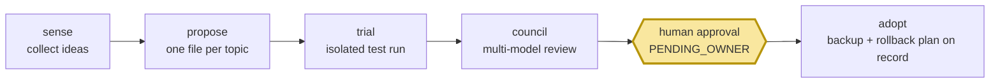

# self-growth-loop

<div align="center">

[🇺🇸 English](README.md) ｜ [🇯🇵 日本語](README.ja.md) ｜ [🇨🇳 简体中文](README.zh.md) ｜ **🇹🇭 ไทย**


[](https://github.com/caty-ai/self-growth-loop/actions/workflows/test-lint.yml)
[](LICENSE)


AI ของคุณมักจะเสนอไอเดียปรับปรุงการตั้งค่าของตัวเองอยู่เรื่อย ๆ — เครื่องมือใหม่ พรอมป์ที่ดีขึ้น การปรับ workflow<br>
การนำไอเดียเหล่านั้นมาใช้เองด้วยมือนั้นขยายผลไม่ได้ ส่วนการปล่อยให้ AI เปลี่ยนแปลงสิ่งต่าง ๆ เองก็มักจะทำให้การตั้งค่าพังไปเงียบ ๆ<br>
self-growth-loop เปลี่ยนทุกข้อเสนอให้กลายเป็นข้อเสนอที่ถูกติดตาม ซึ่งต้องพิสูจน์ตัวเองผ่านการทดสอบ การรีวิวที่ปรับตามระดับความเสี่ยง และ **การอนุมัติที่ชัดเจนจากคุณ** ก่อนที่จะมีการเปลี่ยนแปลงใด ๆ

**การเติบโตที่ตรวจสอบได้ ทุกการเปลี่ยนแปลงต้องผ่านด่านมนุษย์**

🔧 [คู่มือวิศวกรรม](INTEGRATION.md) ｜ 📘 [ข้อกำหนดเชิงเทคนิค](docs/ledger-spec.md)

</div>

---

## คุ้นเคยไหม?

- ผู้ช่วย AI ของคุณบอกว่า "เราควรเอาเครื่องมือ X มาใช้" — แล้วไอเดียนั้นก็จบลงในบันทึกแชท เพราะไม่มีกระบวนการรองรับ
- คุณเคยลองปล่อยให้ agent ปรับแต่งการตั้งค่าของตัวเองครั้งหนึ่ง แล้วต้องเสียเวลาทั้งเย็นเพื่อหาว่าอะไรเปลี่ยนไปบ้าง
- ไอเดียปรับปรุงกองพะเนินโดยไม่มีบันทึกว่าอะไรถูกลอง อะไรได้ผล และอะไรถูกปฏิเสธ
- คุณอยากให้ AI ของคุณดีขึ้นเรื่อย ๆ ตามเวลา แต่ไม่ใช่แบบลับหลังคุณ

self-growth-loop เกิดขึ้นมาเพื่อเติมเต็มช่องว่างนี้โดยเฉพาะ มันมอบเส้นทางที่ตรวจสอบได้และเบรกให้กับการปรับปรุงที่ขับเคลื่อนโดย AI

---

## มันทำอะไร

ทุกไอเดียปรับปรุงจะกลายเป็น **หนึ่งไฟล์ในบัญชี (ledger)** ที่เคลื่อนผ่านห้าด่าน ไม่มีอะไรข้ามด่านมนุษย์ไปได้



- 📒 **ติดตามได้** — ทุกข้อเสนอเป็นไฟล์ข้อความล้วนที่มีประวัติสถานะครบถ้วน: ใครเสนอ ทดสอบอะไร ใครโหวต ใครอนุมัติ
- 🧪 **ทดสอบก่อนเสมอ** — ข้อเสนอจะรันเป็นงานทดลองที่แยกส่วนอยู่ใน workspace แซนด์บ็อกซ์ของ engine ไม่มีวันแตะการตั้งค่าจริงของคุณ
- 🗳️ **ตรวจสอบไขว้กัน** — สิ่งใดก็ตามที่เกินระดับความเสี่ยงต่ำสุดจะได้รับการตรวจสอบจากคณะกรรมการ AI หลายโมเดลที่รีวิวหลักฐานการทดลองอย่างอิสระต่อกัน ก่อนที่จะส่งมาถึงคุณ
- ✋ **รอคุณเสมอ** — ทุกการนำไปใช้จะหยุดอยู่ที่คิวอนุมัติ จนกว่ามนุษย์จะตอบตกลง ไม่มีอะไรนำไปใช้เองได้
- 🔙 **ถอยกลับได้** — ทุกการนำไปใช้จะบันทึกการอ้างอิงข้อมูลสำรองที่ตรวจสอบแล้วและแผนย้อนกลับไว้ และมี lint — ที่รันทุกวันโดย cron ที่มากับระบบเมื่อติดตั้งแล้ว — คอยจับบันทึกที่ค้างหรือเสียหาย

นี่คือเส้นทางชีวิตของข้อเสนอหนึ่งรายการ ตั้งแต่ต้นจนจบ

---

## วงจรใน 60 วินาที

เส้นทางชีวิตของข้อเสนอหนึ่งรายการ: ไอเดียจากฟีด ("เครื่องมือ X ดูน่าใช้") กลายเป็นบันทึกในบัญชี (`PROPOSED`) ตัวรัน trial จะแพ็กมันเป็นงานแล้วส่งให้ engine ซึ่งรันในพื้นที่ทำงานที่แยกส่วน (`TRIALING`) ผลลัพธ์กลับมาเป็นไฟล์หลักฐาน สำหรับสิ่งใดก็ตามที่เกินระดับความเสี่ยงต่ำสุด คณะกรรมการจาก AI หลายโมเดลแต่ละตัวจะอ่านหลักฐานและโหวต (`COUNCIL` — ส่วนระดับความเสี่ยงต่ำสุดที่ย้อนกลับได้จะบันทึกเป็นการข้ามแบบปิดผนึกแทน แล้วส่งตรงไปยังคิวของคุณ) หากผ่าน บันทึกนั้นจะรอในคิวอนุมัติของคุณ (`PENDING_OWNER`) — รายงานคิวจะแสดงทุกการตัดสินใจที่รออยู่ให้คุณเห็น หลังจากที่คุณอนุมัติเท่านั้น บันทึกจึงจะย้ายไปเป็น `ADOPTED` พร้อมกับการอ้างอิงข้อมูลสำรองก่อนการนำไปใช้ที่ตรวจสอบแล้วและแผนย้อนกลับที่ระบุปริมาณไว้ในไฟล์เรียบร้อยแล้ว — จากนั้น runtime เจ้าของจะนำการเปลี่ยนแปลงไปใช้จริง หากปฏิเสธ บันทึกก็จะจดจำไว้ตลอดไป — ไอเดียเดิมจะไม่กลับมาอีก เว้นแต่จะมีอะไรเปลี่ยนไปอย่างมีนัยสำคัญ การจะรันสิ่งนี้ด้วยตัวเอง คุณแทบไม่ต้องเตรียมอะไรเลย

---

## สิ่งที่คุณต้องมี

| | ข้อกำหนด | หมายเหตุ |
|---|---|---|
| OS | macOS | ✅ ทดสอบแล้ว (bash 3.2 มาตรฐาน + system ruby ไม่ต้องใช้ gems) |
| | Linux | ⚠️ ยังไม่ได้ทดสอบ |
| การใช้แบบสแตนด์อโลน | ไม่ต้องมีอะไรเพิ่ม | ledger + lint + queue report ทำงานได้ด้วยรีโปนี้เพียงอย่างเดียว |
| การทดลอง | โคลนของ [caty-agent-harness](https://github.com/caty-ai/caty-agent-harness) ในเครื่อง | engine ที่ใช้รันงานทดลอง (ปักหมุดไว้ที่: v0.6.0) |

---

## เริ่มต้นใช้งาน

### ให้ AI ของคุณช่วยตั้งค่า

คัดลอกข้อความนี้ไปวางให้ coding agent ของคุณ (Claude Code, Codex เป็นต้น):

> Clone https://github.com/caty-ai/self-growth-loop and run `make test`. Then show me how to create a demo proposal with scripts/propose.sh against a temporary vault directory.

### หรือลงมือทำเอง

```sh
git clone https://github.com/caty-ai/self-growth-loop.git
cd self-growth-loop

# สร้างข้อเสนอตัวอย่างใน vault ชั่วคราวที่ทิ้งได้
mkdir -p /tmp/sgl-demo-vault
bash scripts/propose.sh --vault /tmp/sgl-demo-vault \
  --topic-key demo-tool__acme --title "Trial the demo tool" \
  --state PROPOSED --proposer mine \
  --url https://example.com/item --report reports/demo.md

# รันการตรวจสุขภาพและอ่านรายงานคิวที่มันเขียนออกมา
bash scripts/growth-lint.sh --vault /tmp/sgl-demo-vault
cat /tmp/sgl-demo-vault/25_review-pending/self-growth-queue.md
```

คุณเพิ่งรันระบบบัญชีของวงจรนี้แบบครบวงจร: บันทึกข้อเสนอถูกสร้างขึ้น ตรวจสอบด้วย lint และถูกรายงาน (รายงานจะโชว์ข้อความ `SENSE BROKEN` — เป็นเรื่องปกติ: เดโมแบบสแตนด์อโลนไม่มีตัวรวบรวมฟีดต่อไว้) ยกเลิกทุกอย่างได้ด้วย `rm -rf /tmp/sgl-demo-vault` — ตัวรีโปเองไม่เคยถูกเขียนทับเลย

<details>
<summary>รันชุดทดสอบทั้งหมด (ต้องมี engine)</summary>

```sh
# ~/claude-workspace/caty-agent-harness คือ default lookup path (SGL_ENGINE_SOURCE)
git clone https://github.com/caty-ai/caty-agent-harness.git ~/claude-workspace/caty-agent-harness
cd self-growth-loop
make test                  # ชุดทดสอบทั้งหมด; engine integration test จะขับเคลื่อน engine ตัวจริง
```

ชี้ `SGL_ENGINE_SOURCE` ไปยังโคลนของ engine คุณ ถ้ามันอยู่ที่อื่น

</details>

---

## ทำไมถึงลองใช้ได้อย่างปลอดภัย

- **ด่านมนุษย์เป็นโครงสร้าง ไม่ใช่แค่มารยาท** ทุกการนำไปใช้จะหยุดที่ `PENDING_OWNER` คิวอนุมัติเฉพาะของเจ้าของระบบ ([กฎการกำกับดูแล](https://github.com/caty-ai/caty-agent-harness/blob/main/docs/governance-rules.md)ของ engine, กฎ R4) — และ[กฎการนำไปใช้](docs/adoption-wiring.md)ของรีโปนี้เองก็บังคับใช้กับทุกระดับ: เส้นทางข้ามคณะกรรมการสำหรับความเสี่ยงต่ำสุดจะไม่มีวันข้ามเจ้าของระบบไปได้ ไม่มีเส้นทางโค้ดใดที่จะเลื่อนบันทึกไปเป็น `ADOPTING` ได้โดยไม่มีหลักฐานการอนุญาตจากเจ้าของระบบที่ตรวจสอบแล้ว ส่วนการเปลี่ยนแปลงที่กระทบต่ออัตลักษณ์จะต้องผ่านคณะกรรมการเต็มรูปแบบเพิ่มเติมเสมอ (กฎ R12a)
- **การทดลองไม่มีวันแตะการตั้งค่าจริงของคุณ** มันรันอยู่ใน workspace ของ engine ที่แยกส่วน ([docs/trial-isolation.md](docs/trial-isolation.md)) สิ่งเดียวที่ปลั๊กอินนี้เขียนลงใน engine คือไฟล์งาน
- **โปรโตคอลผู้เขียนคนเดียวพร้อมการล็อก** บัญชีกำหนดผู้เขียนบันทึกไว้เพียงคนเดียว (บวกกับช่องทาง timeout แคบ ๆ ของ lint) ทุกการเขียนต้องผ่านล็อกเดียวกัน และทุกการเปลี่ยนสถานะจะทิ้งบรรทัดเหตุการณ์ไว้ — สถานะจึงไม่สามารถถูกเขียนทับอย่างเงียบ ๆ ได้ ([docs/ledger-spec.md](docs/ledger-spec.md))
- **การย้อนกลับเป็นส่วนหนึ่งของการนำไปใช้** บันทึกจะไม่สามารถได้รับการอนุมัติได้เลยหากไม่มีการอ้างอิงข้อมูลสำรองก่อนการนำไปใช้ที่ตรวจสอบแล้ว ส่วนเส้นทางย้อนกลับที่ระบุปริมาณไว้จะถูกตรวจสอบโดย lint ที่รันทุกวัน ([docs/adoption-wiring.md](docs/adoption-wiring.md))

ไม่เหมาะกับคุณถ้า: คุณต้องการ agent ที่พัฒนาตัวเองแบบอัตโนมัติเต็มรูปแบบโดยไม่มีมนุษย์อยู่ในวงจรเลย — เครื่องมือนี้ถูกสร้างขึ้นมาเพื่อป้องกันสิ่งนั้นโดยเฉพาะ

---

## แบบสแตนด์อโลนหรือแบบเชื่อมต่อ

- **สแตนด์อโลน** — รีโปนี้บวกกับไดเรกทอรีสำหรับบัญชี เสนอ ตรวจสอบด้วย lint และรีวิวด้วยมือ (นี่คือสิ่งที่ Quickstart ด้านบนทำ)
- **เชื่อมต่อ** — เชื่อมเข้ากับระบบที่กว้างขึ้น ทุกอย่างเป็นตัวเลือกเสริม: ตัวรวบรวมฟีดที่ป้อนไอเดีย (sense — เช่น [X Collector](https://github.com/caty-ai/x-collector)), engine [caty-agent-harness](https://github.com/caty-ai/caty-agent-harness) ที่รันการทดลอง, launchd cron สำหรับ lint ประจำวัน (`ops/`, วิธีติดตั้งอยู่ใน [INTEGRATION.md](INTEGRATION.md)) และสัญญาณ dead-man heartbeat หากคุณมีระบบมอนิเตอร์ภายนอก

---

## สิ่งที่พัฒนาแล้ว

| ส่วนประกอบ | สถานะ | อยู่ที่ไหน |
|---|---|---|
| บัญชีข้อเสนอ (schema, state machine, single-writer) | ✅ พัฒนาแล้ว | [docs/ledger-spec.md](docs/ledger-spec.md), `scripts/propose.sh` (#1) |
| การมองเห็นความล้มเหลว (growth-lint, queue report, timeouts) | ✅ พัฒนาแล้ว | `scripts/growth-lint.sh` (#2, #5) |
| ตัวรัน trial (task bundle ผ่าน engine `tr-enqueue`) | ✅ พัฒนาแล้ว | `scripts/trial-enqueue.sh`, `trial-poll.sh` (#6, #21) |
| Council (คำตัดสินไขว้โมเดล, องค์ประชุมตามระดับ) | ✅ พัฒนาแล้ว | `scripts/council-*.sh`, [docs/council-wiring.md](docs/council-wiring.md) (#10, #13) |
| ตัวดำเนินการนำไปใช้ (คิวอนุมัติ, บันทึกการย้อนกลับ) | ✅ พัฒนาแล้ว | `scripts/adopt-*.sh`, [docs/adoption-wiring.md](docs/adoption-wiring.md) (#11, #16) |
| การแยกไลบรารีร่วม | ⏳ เลื่อนออกไป | ตั้งใจรอปลั๊กอินตัวที่สอง (ดูนโยบายการแยกใน plugin-convention ของ engine) |

ทุกแถวที่ ✅ มาพร้อมชุดทดสอบ — รันด้วย `make test`; ชุดทดสอบรวมถึง engine integration test ที่ขับเคลื่อน engine ตัวจริงที่แท็กเวอร์ชันที่ปักหมุดไว้

---

## สถานะโครงการ

- **CI:** ทุก pull request จะรัน test/lint caller ที่ใช้ร่วมกันทั้งบน Ubuntu และ macOS พร้อมกับ gitleaks, history-check, PR size, publication gate และ risk review โดย `main` กำหนดให้ทั้งแปดรายการต้องผ่าน ส่วน `make test` ยังคงเป็นด่านตรวจสอบในเครื่อง
- **สภาพแวดล้อมที่ตรวจสอบแล้ว:** macOS และ Ubuntu (bash 3.2+, system ruby) ทั้งสองถูกรันโดย CI ในทุก pull request ยังไม่ได้ตรวจสอบระบบปฏิบัติการอื่น
- **ระดับความพร้อม:** **reference** — เป็นระดับที่แคมเปญกำหนดให้รีโปนี้ ส่วนการเชื่อมต่อด่านการเผยแพร่ได้ติดตั้งเรียบร้อยแล้ว
- **ข้อจำกัดที่ทราบ:** ต้องมี ruby (หากไม่มี สคริปต์ทางเข้าจะจบด้วยรหัส 127); การเชื่อมต่อ engine ถูกปักหมุดที่ [caty-agent-harness v0.6.0](https://github.com/caty-ai/caty-agent-harness/tree/v0.6.0)

---

## เรียนรู้เพิ่มเติม

| เอกสาร | เนื้อหาด้านใน |
|---|---|
| [INTEGRATION.md](INTEGRATION.md) | รอยต่อของ engine, เวอร์ชันที่ปักหมุด, การติดตั้ง cron, นโยบาย integration-test |
| [docs/ledger-spec.md](docs/ledger-spec.md) | Schema ของบันทึก, การระบุตัวตนของหัวข้อ, state machine, การล็อก |
| [docs/trial-isolation.md](docs/trial-isolation.md) | ระดับการแยกส่วนตามระดับความเสี่ยง |
| [docs/council-wiring.md](docs/council-wiring.md) | องค์ประกอบคณะกรรมการ, schema คำตัดสิน, องค์ประชุม, การลองใหม่ |
| [docs/adoption-wiring.md](docs/adoption-wiring.md) | กลไกด่านอนุมัติ, การนำออกใช้งาน, การย้อนกลับ |

<!-- family:generated:family-footer:start -->

---

รีโพนี้เป็นส่วนหนึ่งของ **ครอบครัว Caty AI** — ชุดเครื่องมือโอเพนซอร์สสำหรับดูแลครอบครัวเอเจนต์ AI แผนที่ฉบับเต็ม (รวมโมดูลที่กำลังเตรียมเปิด) อยู่ที่ [Family OS](https://github.com/caty-ai/family-os)

| แกน | โมดูล | ทำอะไร | สถานะ |
| --- | --- | --- | --- |
| แผนที่ | [Family OS](https://github.com/caty-ai/family-os) | แผนที่ของทั้งครอบครัว — โมดูล สถานะ และโครงสร้าง | เปิดแล้ว・MIT |
| กติกา | [Family Dev Handbook](https://github.com/caty-ai/family-dev-handbook) | กติกากลางของการพัฒนา — Issue, PR, worktree, การส่งงานต่อ และการทำงานคู่ขนาน | เปิดแล้ว・MIT |
| แกนตั้ง · รากฐาน | [Caty Agent Harness](https://github.com/caty-ai/caty-agent-harness) | แกนงานของเอเจนต์ AI — การลองใหม่ เช็คพอยต์ และการตัดสินว่าเสร็จจริง | เปิดแล้ว・MIT |
| แกนตั้ง | [context-kit](https://github.com/caty-ai/context-kit) | ชุดดูแลคอนเท็กซ์ 6 ชิ้นสำหรับเอเจนต์หนึ่งตัว — จำกัดเอาต์พุตขนาดใหญ่, ตรวจ brief การมอบงาน, การ์ดความปลอดภัย, ค้นความทรงจำ, snapshot ของ worktree | เปิดแล้ว・MIT |
| แกนตั้ง | [Persona Engine](https://github.com/caty-ai/persona-engine) | มอบบุคลิกให้เอเจนต์ — เลเยอร์บุคลิกและอารมณ์แบบไล่ระดับ | เปิดแล้ว・MIT |
| แกนตั้ง | [Persona Growth Loop](https://github.com/caty-ai/persona-growth-loop) | พัฒนาบุคลิกของเอเจนต์ — สร้างข้อเสนอแบบน้อยที่สุดและทำซ้ำได้ | เปิดแล้ว・MIT |
| แกนตั้ง | [X Collector](https://github.com/caty-ai/x-collector) | รวบรวมข้อมูลจาก X และเว็บเป็นสรุปวันละฉบับ — สำหรับคนและเอเจนต์ | เปิดแล้ว・MIT |
| แกนตั้ง | **Self Growth Loop** | วงจรให้เอเจนต์พัฒนาความสามารถของตัวเอง — ข้อเสนอ ธรรมาภิบาล และบันทึกการนำไปใช้ | เปิดแล้ว・MIT |
| แกนนอน · รากฐาน | [Family Memory Architecture](https://github.com/caty-ai/family-memory-architecture) | บัสความทรงจำ — ชั้นที่ครอบครัวใช้แบ่งปันสิ่งที่รู้ | เปิดแล้ว・MIT |
| แกนนอน | [Sitter](https://github.com/caty-ai/sitter) | พี่เลี้ยงของงานที่มอบหมายให้เอเจนต์ — เฝ้าดู เก็บหลักฐาน และรีสตาร์ต | เปิดแล้ว・MIT |

<!-- family:generated:family-footer:end -->

---

## การมีส่วนร่วม

Issue-first: 1 issue = 1 branch = 1 pull request ไม่มีการ merge เอง ดู [CONTRIBUTING.md](CONTRIBUTING.md) และ [family dev handbook](https://github.com/caty-ai/family-dev-handbook)

---

## สัญญาอนุญาต

[MIT](LICENSE) — เพื่อให้ทุกคนใช้ ศึกษา และต่อยอดได้อย่างอิสระ

---

<div align="center">

**bash + ruby ไม่ต้องใช้ gems** ｜ **หนึ่งข้อเสนอ = หนึ่งไฟล์** ｜ **ทุกการเปลี่ยนแปลงต้องผ่านด่านมนุษย์**

</div>
