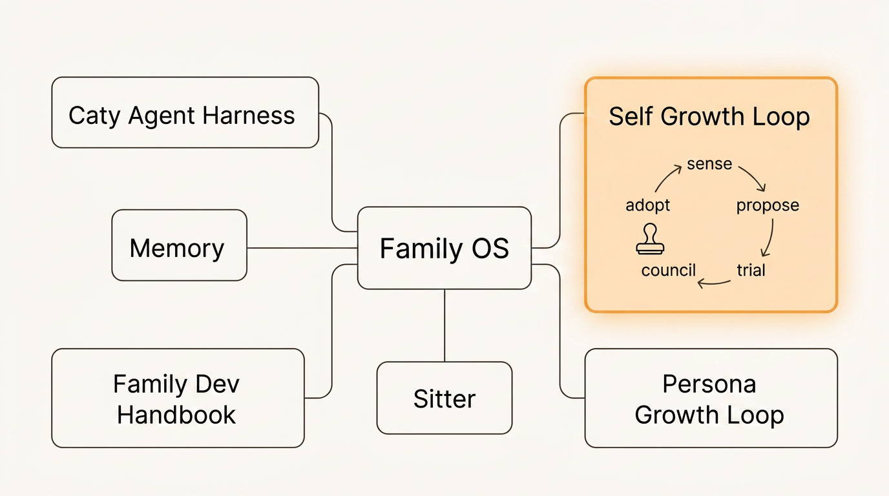
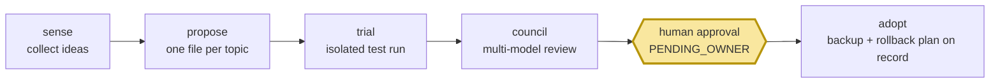

# self-growth-loop

<div align="center">

[🇺🇸 English](README.md) ｜ [🇯🇵 日本語](README.ja.md) ｜ **🇨🇳 简体中文** ｜ [🇹🇭 ไทย](README.th.md)



[](https://github.com/caty-ai/self-growth-loop/actions/workflows/test-lint.yml)
[](LICENSE)


你的 AI 一直在给自己的运行环境提出改进建议——新工具、更好的提示词、工作流调整。<br>
手动逐一采纳这些建议无法规模化；而放手让 AI 自行修改，环境往往在不知不觉中就被弄坏了。<br>
self-growth-loop 把每一条建议都变成一份可追踪的提案，必须先经过测试、按风险分级的评审，以及**你的明确批准**，才能真正生效。

**可审计的成长。每一次变更都要经过人工把关。**

🔧 [工程指南](INTEGRATION.md) ｜ 📘 [规格文档](docs/ledger-spec.md)

</div>

---

## 这些场景是不是很熟悉？

- 你的 AI 助手说"我们应该采用工具 X"——结果这个想法就消失在聊天记录里，因为根本没有相应的处理流程
- 你曾经放手让 agent 调整自己的配置，结果花了一整晚才搞清楚到底改了什么
- 改进想法不断堆积，却没有任何记录——哪些被尝试过、哪些有效、哪些被否决
- 你希望 AI 能持续变得更好，但不希望它在你背后悄悄行动

self-growth-loop 正是为填补这个空白而存在：它为 AI 驱动的改进提供了一份完整的记录，也装上了一个刹车踏板。

---

## 它是做什么的

每一个改进想法都会变成**账本（ledger）中的一个文件**，依次经过五道关卡。没有任何一步能绕开人工审批这道关。



- 📒 **可追踪** —— 每一份提案都是带有完整状态历史的纯文本文件：谁提出的、测试了什么、谁投了票、谁批准了
- 🧪 **先测试** —— 提案会作为隔离的试运行任务，在沙盒化的引擎工作区中执行，绝不会碰到你的实际运行环境
- 🗳️ **交叉验证** —— 只要风险等级不是最低档，就会有一个由不同 AI 模型组成的评审团，在结果送到你面前之前独立审阅试运行的证据
- ✋ **等待你的决定** —— 每一次采纳都会停在审批队列，直到有人明确点头；没有任何变更会自行生效
- 🔙 **可以回退** —— 每一次采纳都会记录一份经过验证的备份引用和回滚方案，而巡检——一旦安装好，就由内置的定时任务每日运行——会捕捉卡住或损坏的记录

下面是一份提案从头到尾的完整生命周期。

---

## 60 秒了解整个循环

一份提案的一生是这样的：一条来自信息源的想法（"工具 X 看起来不错"）变成账本中的一条记录（`PROPOSED`）。试运行执行器把它打包成任务并交给引擎，引擎在隔离的工作区中运行它（`TRIALING`）。运行结果以证据文件的形式返回；只要风险等级不是最低档，一个由不同 AI 模型组成的评审团就会各自阅读这些证据并投票（`COUNCIL`——而风险最低、可逆的那一档则会记录一次"密封跳过"，直接进入你的审批队列）。如果通过，这条记录就会进入你的审批队列等待（`PENDING_OWNER`）——队列报告会展示所有等待中的决策。只有在你批准之后，记录才会转入 `ADOPTED`：这一步会先在文件中写好经过验证的、采纳前的备份引用和量化的回滚方案，然后由负责该环境的运行时来实际应用这个变更。如果被否决，记录会永久保留否决的结果——同一个想法不会再次出现，除非出现了实质性的变化。想要亲自跑一遍，你几乎不需要准备什么。

---

## 你需要准备什么

| | 要求 | 说明 |
|---|---|---|
| 操作系统 | macOS | ✅ 已测试（系统自带 bash 3.2 + 系统 ruby，无需 gem） |
| | Linux | ⚠️ 未经测试 |
| 独立使用 | 无需其他依赖 | 账本、巡检、队列报告仅凭本仓库即可运行 |
| 试运行 | 本地检出的 [caty-agent-harness](https://github.com/caty-ai/caty-agent-harness) | 负责执行试运行任务的引擎（锁定版本：v0.6.0） |

---

## 开始使用

### 让你的 AI 帮你搭建

把下面这段话粘贴给你的编程 agent（Claude Code、Codex 等）：

> 克隆 https://github.com/caty-ai/self-growth-loop 并运行 `make test`。然后告诉我如何用 scripts/propose.sh 在一个临时的 vault 目录下创建一个演示提案。

### 或者自己动手

```sh
git clone https://github.com/caty-ai/self-growth-loop.git
cd self-growth-loop

# 在一个用完即弃的临时 vault 中创建一个演示提案
mkdir -p /tmp/sgl-demo-vault
bash scripts/propose.sh --vault /tmp/sgl-demo-vault \
  --topic-key demo-tool__acme --title "Trial the demo tool" \
  --state PROPOSED --proposer mine \
  --url https://example.com/item --report reports/demo.md

# 运行健康检查，并查看它写出的队列报告
bash scripts/growth-lint.sh --vault /tmp/sgl-demo-vault
cat /tmp/sgl-demo-vault/25_review-pending/self-growth-queue.md
```

至此，你已经完整跑通了这个循环的记账流程：创建了一条提案记录，做了巡检，并生成了报告。（报告里会出现 `SENSE BROKEN` 的提示——这是预期行为：独立演示环境本来就没有接入信息源收集器。）用 `rm -rf /tmp/sgl-demo-vault` 即可撤销一切——仓库本身自始至终没有被写入过任何内容。

<details>
<summary>运行完整测试套件（需要引擎）</summary>

```sh
# ~/claude-workspace/caty-agent-harness 是默认的查找路径（SGL_ENGINE_SOURCE）
git clone https://github.com/caty-ai/caty-agent-harness.git ~/claude-workspace/caty-agent-harness
cd self-growth-loop
make test                  # 完整测试套件；其中的引擎集成测试会驱动真实引擎
```

如果你的引擎检出位置不同，请通过 `SGL_ENGINE_SOURCE` 指向它。

</details>

---

## 为什么可以放心尝试

- **人工把关是结构性的，不是走个形式。** 每一次采纳都会停在 `PENDING_OWNER`——这是专门给所有者审批用的队列（引擎[治理规则](https://github.com/caty-ai/caty-agent-harness/blob/main/docs/governance-rules.md)，规则 R4）——本仓库自己的[采纳规则](docs/adoption-wiring.md)也把它应用到每一个风险等级：即便是最低风险、可以跳过评审团的路径，也从来不会跳过所有者本人。没有任何代码路径能在缺少经过验证的所有者授权凭证的情况下，把一条记录推进到 `ADOPTING`；涉及身份核心的变更还会额外始终经过完整的评审团审议（规则 R12a）。
- **试运行绝不会碰到你的实际运行环境。** 它们运行在隔离的引擎工作区中（[docs/trial-isolation.md](docs/trial-isolation.md)）；这个插件唯一会写入引擎的东西就是一个任务文件。
- **带锁的单一写入者协议。** 账本明确指定唯一的记录写入者（外加巡检专用的一条窄时限通道），每一次写入都要经过同一把锁，每一次状态转换都会留下一条事件记录——状态不可能被悄悄改写（[docs/ledger-spec.md](docs/ledger-spec.md)）。
- **回滚是"采纳"这一步的一部分。** 一条记录只有在附带经过验证的、采纳前备份引用之后才能被批准；量化的回滚路径则由每日巡检负责审计（[docs/adoption-wiring.md](docs/adoption-wiring.md)）。

不适合你，如果：你想要的是一个完全自动、没有人在环的自我改进型 agent——这个工具的设计目标恰恰是阻止这种情况发生。

---

## 独立使用或接入更大的体系

- **独立使用** —— 本仓库 + 一个用于存放账本的目录。手动提案、巡检、评审。（上面的快速开始部分演示的正是这种方式。）
- **接入更大体系** —— 接入更完整的运行环境，一切均为可选项：负责提供想法的信息源收集器（sense，例如 [X Collector](https://github.com/caty-ai/x-collector)）、负责运行试运行的 [caty-agent-harness](https://github.com/caty-ai/caty-agent-harness) 引擎、用于每日巡检的 launchd 定时任务（`ops/`，安装说明见 [INTEGRATION.md](INTEGRATION.md)），以及在你有外部监控的情况下可选的失活心跳检测。

---

## 已实现的功能

| 组件 | 状态 | 位置 |
|---|---|---|
| 提案账本（schema、状态机、单一写入者） | ✅ 已实现 | [docs/ledger-spec.md](docs/ledger-spec.md)、`scripts/propose.sh`（#1） |
| 故障可见性（growth-lint、队列报告、超时处理） | ✅ 已实现 | `scripts/growth-lint.sh`（#2、#5） |
| 试运行执行器（通过引擎 `tr-enqueue` 打包任务） | ✅ 已实现 | `scripts/trial-enqueue.sh`、`trial-poll.sh`（#6、#21） |
| 评审团（跨模型裁决、按等级设定法定人数） | ✅ 已实现 | `scripts/council-*.sh`、[docs/council-wiring.md](docs/council-wiring.md)（#10、#13） |
| 采纳执行器（审批队列、回滚记录） | ✅ 已实现 | `scripts/adopt-*.sh`、[docs/adoption-wiring.md](docs/adoption-wiring.md)（#11、#16） |
| 共享库抽取 | ⏳ 延后 | 刻意等待第二个插件出现后再做（参见引擎 plugin-convention 中的抽取策略） |

每一行标记为 ✅ 的功能都配有测试——使用 `make test` 运行；测试套件中包括一个会驱动真实引擎（锁定版本）运行的引擎集成测试。

---

## 项目状态

- **CI:** 每个 pull request 都会在 Ubuntu 和 macOS 上运行共享的 test/lint caller，同时运行 gitleaks、history-check、PR 体积、发布门禁与风险评审；`main` 要求这八项检查全部通过。`make test` 仍然是本地准入门槛。
- **已验证环境:** macOS 与 Ubuntu（bash 3.2+、系统自带的 ruby）；两者都会在每个 pull request 中由 CI 运行。其他操作系统尚未验证。
- **成熟度:** **reference** — 这是本仓库的活动指定级别；发布门禁接线已经落地。
- **已知限制:** ruby 是必需依赖（缺少时入口脚本会以 127 退出）；引擎集成锁定到 [caty-agent-harness v0.6.0](https://github.com/caty-ai/caty-agent-harness/tree/v0.6.0)。

---

## 了解更多

| 文档 | 内容简介 |
|---|---|
| [INTEGRATION.md](INTEGRATION.md) | 引擎接入点、锁定版本、定时任务安装、集成测试策略 |
| [docs/ledger-spec.md](docs/ledger-spec.md) | 记录 schema、主题身份、状态机、加锁机制 |
| [docs/trial-isolation.md](docs/trial-isolation.md) | 按风险等级划分的隔离层级 |
| [docs/council-wiring.md](docs/council-wiring.md) | 评审团组成、裁决 schema、法定人数、重试机制 |
| [docs/adoption-wiring.md](docs/adoption-wiring.md) | 审批关卡机制、发布流程、回滚 |

<!-- family:generated:family-footer:start -->

---

本仓库属于 **Caty AI 家族** — 用于运营 AI 智能体家族的开源工具集。完整地图（包括仍在准备公开的模块）见 [Family OS](https://github.com/caty-ai/family-os)。

| 轴 | 模块 | 做什么 | 状态 |
| --- | --- | --- | --- |
| 地图 | [Family OS](https://github.com/caty-ai/family-os) | 整个家族的地图 — 模块、状态与结构 | 已公开・MIT |
| 规则 | [Family Dev Handbook](https://github.com/caty-ai/family-dev-handbook) | 开发的交通规则 — Issue、PR、worktree、交接与并行开发 | 已公开・MIT |
| 纵轴・基座 | [Caty Agent Harness](https://github.com/caty-ai/caty-agent-harness) | AI 智能体的任务基座 — 重试、检查点与完成判定 | 已公开・MIT |
| 纵轴 | [context-kit](https://github.com/caty-ai/context-kit) | 面向单个智能体的六件上下文卫生工具组 — 限制大输出、委托简报校验、安全防护、记忆检索、worktree 快照 | 已公开・MIT |
| 纵轴 | [Persona Engine](https://github.com/caty-ai/persona-engine) | 为智能体赋予人格 — 分层人格与情感渐变 | 已公开・MIT |
| 纵轴 | [Persona Growth Loop](https://github.com/caty-ai/persona-growth-loop) | 让人格本身成长 — 以最小且幂等的提案 | 已公开・MIT |
| 纵轴 | [X Collector](https://github.com/caty-ai/x-collector) | 把 X 与网络素材汇成每日一份摘要 — 给人也给智能体 | 已公开・MIT |
| 纵轴 | **Self Growth Loop** | 让智能体自我成长的循环 — 提案、治理与采用记录 | 已公开・MIT |
| 横轴・基座 | [Family Memory Architecture](https://github.com/caty-ai/family-memory-architecture) | 记忆总线 — 家族共享所知的一层 | 已公开・MIT |
| 横轴 | [Sitter](https://github.com/caty-ai/sitter) | 替你盯着委派出去的智能体 — 监视、留证、仅在声明范围内重启 | 已公开・MIT |

<!-- family:generated:family-footer:end -->

---

## 贡献指南

Issue 优先：1 个 issue = 1 个分支 = 1 个 pull request，不自行合并。详见 [CONTRIBUTING.md](CONTRIBUTING.md) 和 [family dev handbook](https://github.com/caty-ai/family-dev-handbook)。

---

## 许可证

[MIT](LICENSE) —— 任何人都可以自由使用、研究并在此基础上构建。

---

<div align="center">

**bash + ruby，无需 gem** ｜ **一个提案 = 一个文件** ｜ **每一次变更都要经过人工把关**

</div>
